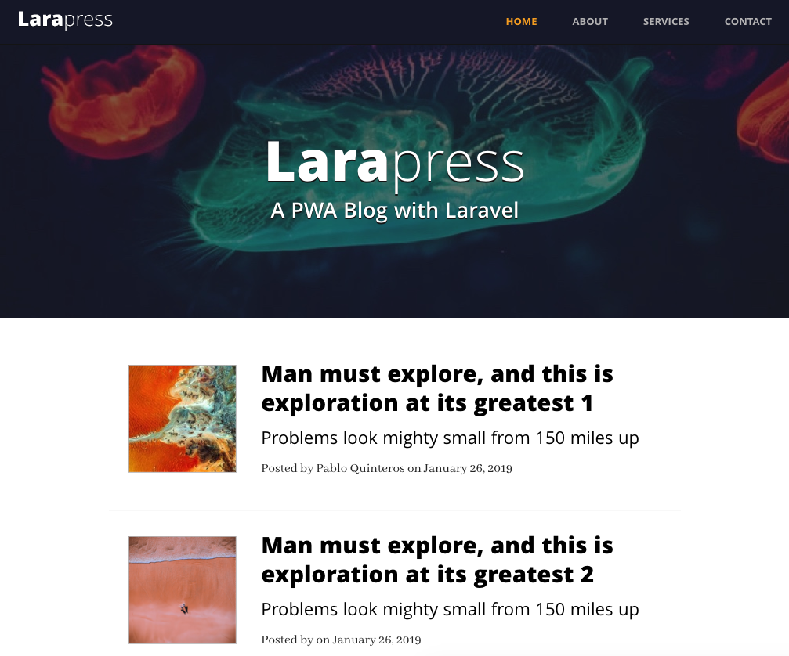
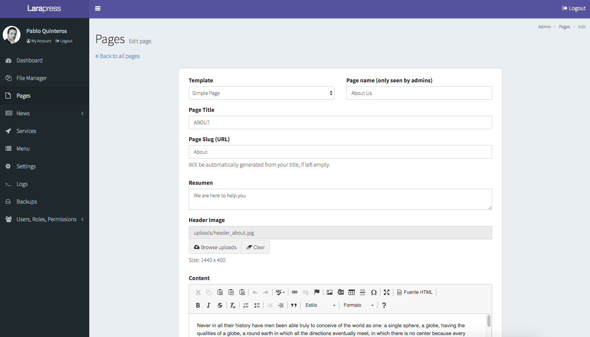

# Larapress

Larapress es un PWA Blog con Laravel. Es un proyecto para profundizar en laravel.

[App](https://pabloquinteros.dev/larapress/) 


<p align="center">
  
</p>

[Admin ](https://pabloquinteros.dev/larapress/)  

```
usuario: invitado@gmail.com 

password: invitado
```

<p align="center">
  
</p>

## Instalación

Puedes usar estos comandos para correr la aplicación.


`npm install` para instalar las dependencias.

`npm run dev` para el entorno de desarrollo.

`npm run prod` para el entorno de producción.

## License

[MIT](https://opensource.org/licenses/MIT)
